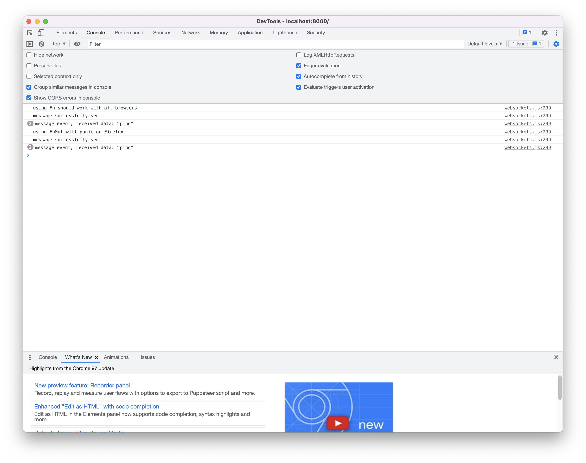
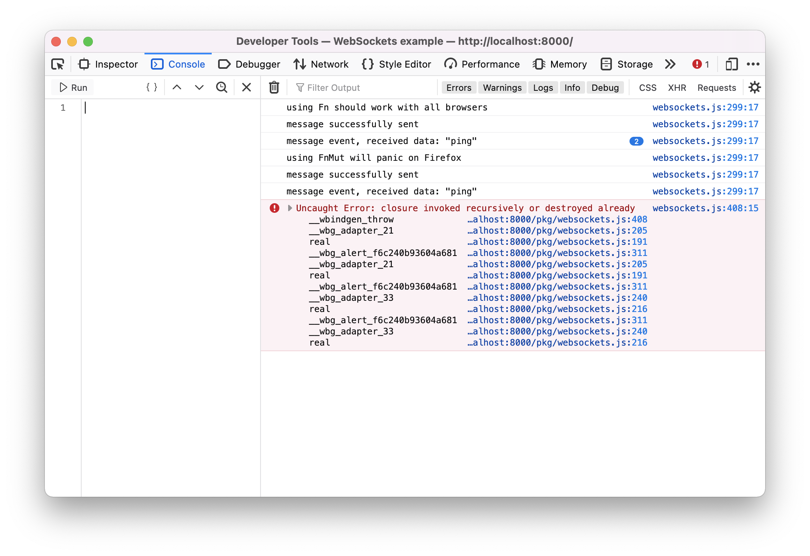

# A Firefox bug reported in May 2012 makes WebSockets flaky

## TLDR: using `dyn Fn` instead of `dyn FnMut` works around the problem

Wasm-bindgen has the ability to make
[Closures](https://docs.rs/wasm-bindgen/latest/wasm_bindgen/closure/struct.Closure.html)
that can be called recursively. However, this is not immediately
obvious to everyone (it escaped my attention for two years!) and the
[wasm-bindgen WebSocket example](https://rustwasm.github.io/wasm-bindgen/examples/websockets.html) does not use recursively callable Closures.

Most people wouldn't expect the need for a WebSocket callback to be
called recursively, but it is necessary when using Firefox if the
WebSocket using app makes certain calls, like alert or opening a
pop-up window. I think [this bug from
2012](https://bugzilla.mozilla.org/show_bug.cgi?id=758004) is the
cause, although it got worse two and a half years ago with the release
Firefox 56.0.

Changing the callbacks from `dyn FnMut` trait objects to `dyn Fn`
trait objects works around this problem, because `dyn Fn` trait
objects result in Closures that [can be called
recursively](https://github.com/rustwasm/wasm-bindgen/blob/main/crates/cli-support/src/js/mod.rs#L2022-L2026).

## Background

I'm developing a web client for a [poker
server](https://github.com/ctm/mb2-doc).  I'm doing it in Rust, using
the [yew](https://github.com/yewstack/yew) framework.  A couple of
years ago I noticed a Firefox specific glitch.  When a tournament
starts, the player should get a pop-up window with the table and the
lobby should show the new table that was created.  That worked fine in
all the other browsers I've tested, but _sometimes_ the lobby wouldn't
note that the new table had been created, but only in Firefox.

Two years ago I knew much less about Rust than I do now, and I wound
up cobbling together a super ugly Firefox specific hack that involved
the server knowing if the client was Firefox and keeping a Firefox
specific queue of messages to replay after the failure to receive a
message. Ugh!

On January 17th, 2022 I revisited the situation and found that using
`dyn Fn` solves the problem, so I updated this repository to
demonstrate the issue and the solution so I can share it with people
who may be interested.

## How to Reproduce

The software here is contrived. It opens a WebSocket, sends a message
to the server, the server then sends two messages back.  In the
message receiving callback, `alert` is invoked and everything works
fine because `dyn Fn` is used. Then the software does the exact same
thing, but uses `dyn FnMut` and it still works fine on all browsers
(that I know of) other than Firefox.

FWIW, in my software where we're getting bitten we're not calling
`alert` anywhere, instead we're opening a pop-up window (for the table
that you're playing poker at). However, the software does not open the
pop-up in the callback. It does so inside the yew `Component`'s
`update` function. So, I can't simply solve my problem by moving the
pop-up open out of the callback, because it's not in the callback.  I
only am doing `alert` in the callback to get reproducible behavior
that illustrates the solution and the problem.


### Prerequisites

You need to [install Rust](https://www.rust-lang.org/tools/install) and
[install wasm-pack](https://rustwasm.github.io/wasm-pack/installer/).

### Build and start the modified echo server

In a terminal, type `cargo run`.  It should look something like this:
```
$ cargo run
...
    Finished dev [unoptimized + debuginfo] target(s) in 0.05s
     Running `target/debug/server`
```

### Build and start the wasm_bindgen client

In a separate terminal, install the binaries from the https package using
`cargo install https`.  It should look something like this:
```
$ cargo install https
    Updating crates.io index
...
   Compiling rfsapi v0.1.0
    Finished release [optimized] target(s) in 1m 02s
  Installing /Users/ctm/.cargo/bin/http
  Installing /Users/ctm/.cargo/bin/httplz
   Installed package `https v1.9.1` (executables `http`, `httplz`)
```

Now cd into `clients/wasm_bindgen`, build and launch the client using `wasm-pack build --target web &&
http`.  It should look something like this:
```
$ cd clients/wasm_bindgen
$ wasm-pack build --target web && http
[INFO]: 🎯  Checking for the Wasm target...
[INFO]: 🌀  Compiling to Wasm...
...
    Finished release [optimized] target(s) in 28.51s
[INFO]: ⬇️  Installing wasm-bindgen...
[INFO]: Optional fields missing from Cargo.toml: 'description', 'repository', and 'license'. These are not necessary, but recommended
[INFO]: ✨   Done in 28.62s
[INFO]: 📦   Your wasm pkg is ready to publish at ./pkg.
Hosting "." on port 8000 without TLS and no authentication...
Ctrl-C to stop.
```

In the browser you want to test, go to the URL
[http://localhost:8000](http://localhost:8000). You should get four
alerts and the Web (or JavaScript) console should not have any panics unless you're running on Firefox in which case you should have one panic.

Here's what the console looks like on Brave:



Here's what the console looks like on Firefox:



## What now?

I'm currently using a [fork of
`wasm-sockets`](https://github.com/ctm/wasm-sockets/tree/fn-not-fn-mut)
that uses `dyn Fn`. I deployed my client using this fork yesterday and
asked adventurous people to test it under Firefox.  I play the
evening tournament every day and for the next few days I'll play
using Firefox. I have some reason to believe that this truly works
around the Firefox bug, but I can't actually be sure. This stuff
is a bit too tricky for me to reason about with a high degree of
confidence.

I realize that `dyn Fn` is more restrictive than `dyn FnMut`. And I
also realize it's hard to succinctly describe this bug and furthermore,
I realize that it won't even bite Firefox users if the code that's
using the WebSockets doesn't call `alert`, open a window or make
any other call that can cause the JavaScript event loop to be run in
a surprising manner.


However, as the Rust WASM ecosystem grows, other people may run into
this problem too.

## My development environment

My initial development and testing was done on MacOS running 10.15.3,
but recently I've updated this repository and did all my work under
macOS 12.1.

